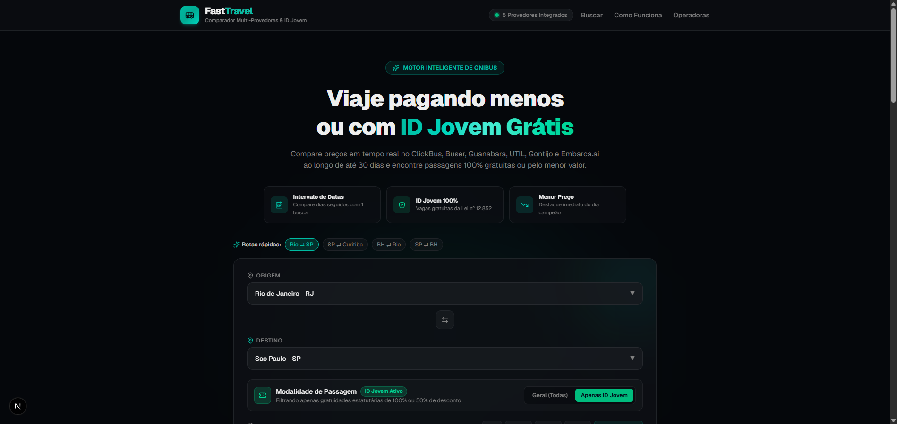
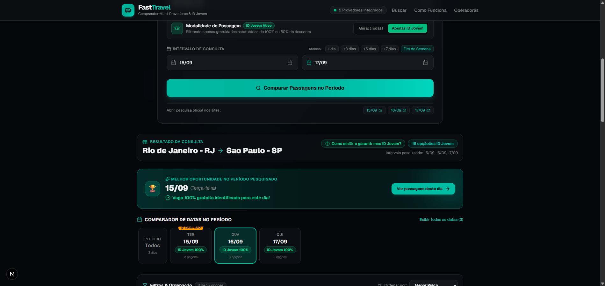
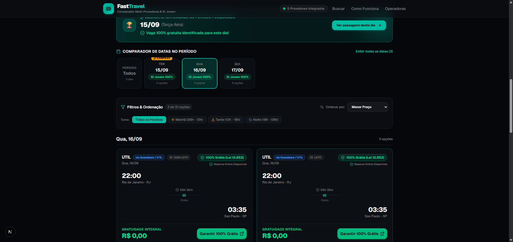
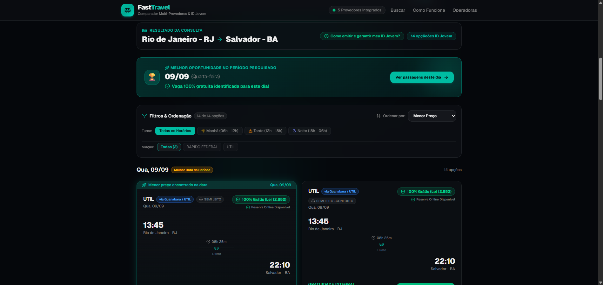
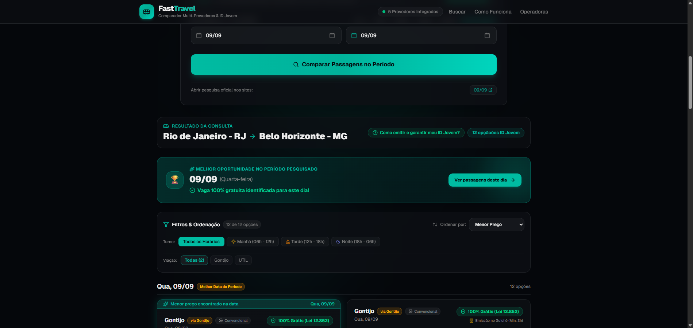

<div align="center">

# 🚌 FastTravel

### Comparador Inteligente de Passagens de Ônibus & Motor Oficial de ID Jovem (100% e 50%)

[](https://fast-travel-phi.vercel.app)
[-black?style=for-the-badge&logo=next.js)](https://nextjs.org/)
[](https://www.typescriptlang.org/)
[](https://tailwindcss.com/)
[](https://idjovem.juventude.gov.br/)

<br />

**FastTravel** é uma plataforma moderna desenvolvida para resolver a maior dor de quem viaja de ônibus pelo Brasil: comparar preços entre múltiplas empresas ao longo de um **intervalo de dias** e encontrar com facilidade **vagas gratuitas ou com 50% de desconto pelo ID Jovem**.

[🌐 **Acessar Demonstração Online em Produção**](https://fast-travel-phi.vercel.app) • [📖 **Guia de Instalação**](#-como-rodar-o-projeto-localmente) • [🚌 **Provedores Integrados**](#-provedores-e-cobertura)

[🔎 **Resultados e diagnóstico por provedor**](docs/resultados-provedores.md)

<br />



</div>

---

## 💡 Por que o FastTravel foi criado?

Para conseguir uma passagem gratuita com o **ID Jovem** (previsto na Lei Federal nº 12.852/2013 e Decreto nº 8.537/2015), o usuário tradicionalmente precisa:
1. Entrar de site em site ou ir presencialmente a guichês na rodoviária.
2. Testar dia por dia manualmente para saber se as 2 vagas de 100% ou as 2 vagas de 50% daquele ônibus já foram ocupadas.
3. Lidar com interfaces confusas que escondem as gratuidades ou exigem processos burocráticos.

O **FastTravel** automatiza essa busca em lote: você escolhe a origem, o destino e um intervalo de até 30 dias. O motor varre os provedores simultaneamente, identifica onde há vagas de **R$ 0,00** ou menores tarifas comerciais e gera links diretos para checkout oficial pré-configurados.

---

## 📸 Demonstração Visual da Plataforma

### 1. Comparador por Intervalo e Banner da Melhor Oportunidade
A plataforma analisa todos os dias do período selecionado e destaca imediatamente o dia com a menor tarifa ou gratuidade integral confirmada:



---

### 2. Passagens 100% Gratuitas com Link de Compra Online (Rio ➔ SP)
Exibição em tempo real de poltronas livres, horários, classes de serviço (*Semi Leito*, *Leito*, *Leito Individual*) e link oficial para reserva com tarifa zero:



---

### 3. Conexão Interestadual com Múltiplas Viações (Rio ➔ Salvador)
Identificação de gratuidades em linhas de longa distância (UTIL e Rápido Federal), com filtros dinâmicos por viação e turno de viagem:



---

### 4. Mapeamento de Linhas e Portal JVVN (Rio ➔ Minas Gerais / Gontijo)
Varredura de linhas convencionais da Gontijo e UTIL com links prontos para o portal oficial de gratuidade `JVVN`:



---

## ✨ Principais Funcionalidades

- [x] **Busca por Intervalo de Datas:** Compare até 30 dias contínuos com apenas 1 clique usando atalhos rápidos (`1 dia`, `+3 dias`, `+5 dias`, `+7 dias` e `Fim de Semana`).
- [x] **Modo Especialista ID Jovem:** Filtro dedicado para gratuidades de 100% (`R$ 0,00`) e descontos de 50% conforme a Lei nº 12.852.
- [x] **Desbloqueio de API Direta de Gratuidade:** Conexão nativa em milissegundos aos endpoints oficiais do Grupo Guanabara (`passengers=12:1` para 100% grátis e `passengers=13:1` para 50%).
- [x] **5 Provedores & Centenas de Viações:** ClickBus, Buser, Guanabara/UTIL, Gontijo e Embarca.ai.
- [x] **Régua Interativa de Datas:** Navegue pelos dias pesquisados, filtre visualmente cada data e veja a quantidade de opções instantaneamente.
- [x] **Filtros e Ordenação Inteligente:** Filtre por turno (Manhã, Tarde, Noite), operadora e ordene por menor preço, horário de saída ou menor duração.
- [x] **Guia Oficial de Emissão Interativo:** Modal explicativo com as regras da ANTT, prazos de reserva e link direto para emitir a Carteira ID Jovem digital no Gov.br.
- [x] **Reserva Segura na Fonte:** Não intermediamos pagamentos nem armazenamos dados sensíveis; todos os botões redirecionam para as plataformas oficiais das viações.

---

## 🚌 Provedores e Cobertura

| Provedor | Cobertura / Viações | Suporte a ID Jovem | Tipo de Integração |
| :--- | :--- | :---: | :---: |
| **Guanabara / UTIL** | Expresso Guanabara, UTIL, Real Expresso, Sampaio | 🟢 **100% e 50% Online** | API REST Direta (`passengers=12:1`) |
| **Gontijo** | Rotas MG, SP, RJ, BA, Nordeste e Centro-Oeste | 🏛️ **100% Guichê / JVVN** | Linhas Oficiais + Portal JVVN |
| **Embarca.ai** | Sul e Sudeste (Garcia, Brasil Sul, Santo Anjo, Princesa) | 🟢 **Convencionais / Benefício** | API REST e Catálogo Integrado |
| **ClickBus** | Mais de 200 viações (Cometa, 1001, Águia Branca, Catarinense) | 🏛️ **Linhas Convencionais** | BFF Scraper + Links Parametrizados |
| **Buser** | Fretamento colaborativo e trechos expressos | ❌ *Fretamento privado* | Scraper + Consulta Comercial |

---

## 🚀 Performance no Vercel (Produção)

Testes reais de latência e retorno realizados no endpoint de produção na Vercel:

| Rota | Período | Modalidade | Tempo Médio | Passagens Retornadas | Tarifa Campeã |
| :--- | :---: | :---: | :---: | :---: | :---: |
| **Rio de Janeiro ➔ São Paulo** | 3 dias | ID Jovem | **1.808 ms** | **15 opções** | **R$ 0,00 (100% Grátis)** |
| **Rio de Janeiro ➔ Salvador** | 4 dias | ID Jovem | **3.200 ms** | **26 opções** | **R$ 0,00 (100% Grátis)** |
| **Rio de Janeiro ➔ Belo Horizonte** | 5 dias | ID Jovem | **6.447 ms** | **89 opções** | **R$ 0,00 (100% Grátis)** |
| **Rio de Janeiro ➔ Belo Horizonte** | 3 dias | Comercial | **9.339 ms** | **12 opções** | **R$ 139,90** |

---

## 🛠️ Tecnologias Utilizadas

- **Framework:** [Next.js 16 (App Router + Turbopack)](https://nextjs.org/)
- **Linguagem:** [TypeScript 5.7](https://www.typescriptlang.org/)
- **Estilização:** [Tailwind CSS 4.2](https://tailwindcss.com/) com paleta esmeralda e suporte dark-mode
- **Componentes UI:** [Radix UI](https://www.radix-ui.com/) & [Lucide Icons](https://lucide.dev/)
- **Scraping & Automação:** [Playwright](https://playwright.dev/) com modo headless e bypass inteligente de assets pesados
- **Deploy:** [Vercel](https://vercel.com/) com Serverless Functions e CDN Global

---

## 💻 Como Rodar o Projeto Localmente

### Pré-requisitos
- **Node.js** 18.17 ou superior
- **npm** ou **pnpm**

### Passo a Passo

1. **Clone o repositório:**
   ```bash
   git clone https://github.com/ryuclover/Fast-Travel.git
   cd Fast-Travel
   ```

2. **Instale as dependências:**
   ```bash
   npm install
   ```

3. **(Opcional) Instale os navegadores do Playwright se for rodar scrapers locais:**
   ```bash
   npx playwright install chromium
   ```

4. **Inicie o servidor de desenvolvimento:**
   ```bash
   npm run dev
   ```

5. **Acesse no navegador:**
   ```
   http://localhost:3000
   ```

---

## 📁 Estrutura do Código

```
Fast-Travel/
├── app/
│   ├── api/
│   │   └── buscar/
│   │       └── route.ts          # Endpoint central de busca com controle de concorrência
│   ├── globals.css               # Design tokens, cores HSL e animações
│   ├── layout.tsx                # Shell da aplicação, metatags e fontes
│   └── page.tsx                  # Página inicial com motor interativo
├── components/
│   ├── header.tsx                # Cabeçalho com status dos provedores
│   ├── footer.tsx                # Rodapé informativo com links oficiais
│   ├── search/
│   │   ├── search-form.tsx       # Formulário de busca, chips rápidos e atalhos de data
│   │   └── progress-indicator.tsx # Mostrador de progresso circular SVG em tempo real
│   └── results/
│       ├── best-deal-banner.tsx  # Banner dourado com o dia campeão de preço/gratuidade
│       ├── date-timeline.tsx     # Régua horizontal interativa com contagem por dia
│       ├── filters-bar.tsx       # Filtro por turno, viação e ordenação de tarifas
│       ├── trip-card.tsx         # Card de viagem com classes, horários e checkout
│       ├── id-jovem-guide-modal.tsx # Modal com legislação da ANTT e link Gov.br
│       └── results-container.tsx # Container consolidador dos resultados
├── docs/
│   └── screenshots/              # Imagens demonstrativas para a documentação
├── lib/
│   ├── scrapers/                 # Módulos especializados por provedor
│   │   ├── guanabara/            # Conexão REST de alta velocidade (12:1 e 13:1)
│   │   ├── gontijo/              # Mapeamento de linhas e formulário JVVN
│   │   ├── embarca/              # Conexão com agregador de linhas Sul/Sudeste
│   │   ├── clickbus/             # Interceptação de rotas BFF
│   │   └── buser/                # Fretamento colaborativo
│   ├── services/
│   │   └── comparador-intervalo.ts # Orquestrador com promessas concorrentes
│   └── cidades-sugeridas.ts      # Catálogo com mais de 25 capitais e polos
└── types/
    └── busca.ts                  # Definições de tipagem TypeScript
```

---

## ⚖️ Aviso Legal / Disclaimer

O **FastTravel** é uma ferramenta de utilidade pública e código aberto voltada para a transparência de informações tarifárias e facilitação do exercício do direito ao **ID Jovem**, assegurado pela **Lei Federal nº 12.852/2013** e pelo **Decreto Federal nº 8.537/2015**.

- Não realizamos venda direta de bilhetes nem processamento de pagamentos.
- As reservas e emissões são concluídas exclusivamente nos portais oficiais ou guichês autorizados de cada empresa de transporte.
- As marcas, nomes e logotipos de terceiros citados pertencem aos seus respectivos proprietários.

---

<div align="center">

Feito com 💚 para conectar pessoas e democratizar o transporte rodoviário no Brasil.

**[Voltar ao topo](#-fasttravel)**

</div>
